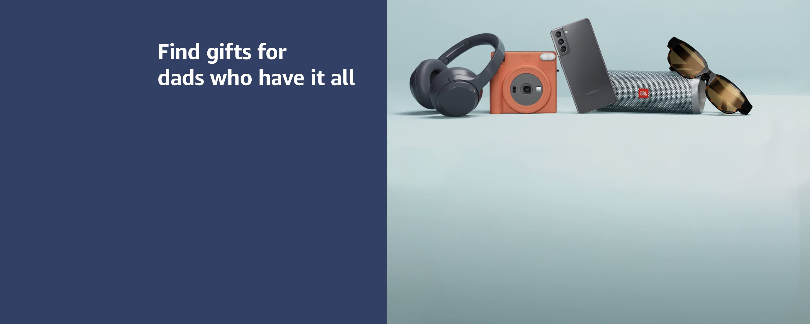

# 🛒 Amazon Clone

A front-end clone of the **Amazon.com** homepage built using pure **HTML5** and **CSS3**, focusing on responsive layout design, pixel-faithful navigation, and modern UI components.

---

## 📸 Preview



---

## ✨ Features

- **Amazon Header & Navigation**:
  - Amazon brand logo with hover border effects
  - Location/Delivery address selector
  - Search bar with category dropdown and search button
  - Accounts & Lists, Returns & Orders menus
  - Cart item indicator with FontAwesome icon
- **Category Panel (Sub-navbar)**:
  - Hamburger menu for "All" categories
  - Quick navigation links (*Prime Video, Customer Service, Today's Deals, Gift Cards, Sell*, etc.)
- **Hero & Card Section**:
  - Featured banner with multi-card shopping recommendations
- **Multi-Item Category Grids**:
  - Organized 4-in-1 product showcase boxes (Electronics, Top PCs, Fitness & Gym Gear, Fashion & Apparel under $25, Home Finds, Radiance & Beauty care, and more).
- **Interactive UI**:
  - Hover highlights, white borders on focus/hover matching Amazon's signature desktop aesthetic.
  - Flexbox-based layout for structured alignment and spacing.

---

## 🛠️ Tech Stack

- **HTML5**: Semantic document structure
- **CSS3**: Custom layout, Flexbox, transitions, hover states
- **Font Awesome (v7.3.1)**: Icons for cart, location, search, and navigation

---

## 📁 Project Structure

```plaintext
Amazon Clone/
│
├── Assets/                 # Images, logos, product card banners, and icons
│   ├── Box1/ to Box8/      # Category grid product images
│   ├── amazon_logo.png     # Amazon official brand logo
│   ├── hero_image.jpg      # Main background hero banner
│   └── card1.avif ...      # Featured cards
│
├── index.html              # Main HTML markup
├── style.css               # Stylesheet containing custom styling & layouts
└── README.md               # Project documentation
```

---

## 🚀 Getting Started

Follow these simple steps to run this project on your local machine:

### 1. Clone the Repository
```bash
git clone https://github.com/sujal-sabale/amazon-clone.git
```

### 2. Open Project Folder
```bash
cd amazon-clone
```

### 3. Run the Project
Simply open `index.html` in your favorite web browser:
- Double click on [index.html](file:///c:/Users/Sujal/Documents/Study/Projects/Amazon%20Clone/index.html)
- Or right-click and choose **Open with Live Server** (if using VS Code)

---

## 🔮 Future Improvements

- [ ] Add functional shopping cart with JavaScript (localStorage)
- [ ] Implement live product search filtering
- [ ] Add Amazon footer section (Back to top, Get to Know Us, Payment Products)
- [ ] Full mobile responsiveness with a collapsible hamburger sidebar

---

## 👤 Author

- **Sujal Sabale**
- GitHub: [@sujal-sabale](https://github.com/sujal-sabale)

---

## 📄 License

This project is created for educational and personal portfolio purposes. Amazon brand and assets are trademarks of Amazon.com, Inc.
